# Windows Server Active Directory Home Lab

## Project Overview

I built a virtual Active Directory environment using Windows Server 2022 and a Windows 11 client in Oracle VirtualBox. This lab allowed me to practise domain administration, user and group management, Group Policy, DNS configuration and troubleshooting, network connectivity testing, and shared-folder permission management.

## Lab Environment

- Domain: `bavtech.com`
- Domain Controller: `CA-183025`
- Domain Controller IP: `10.1.10.2`
- Windows 11 Client: `desktop01`
- Windows 11 Client IP: `10.1.10.3`
- Virtual Network: `LABNET`
- Domain User Tested: `BAVTECH\harsh`

## Technologies Used

- Oracle VirtualBox
- Windows Server 2022
- Windows 11
- Active Directory Domain Services
- DNS
- Group Policy
- PowerShell and Command Prompt
- NTFS and shared-folder permissions

## Tasks Completed

- Created Windows Server 2022 and Windows 11 virtual machines in Oracle VirtualBox
- Connected both virtual machines through the internal `LABNET` network
- Configured Windows Server as a domain controller
- Installed and configured Active Directory Domain Services and DNS
- Created the `bavtech.com` Active Directory domain
- Joined the Windows 11 client to the domain
- Created and managed domain user accounts
- Reset user passwords and enabled or disabled accounts
- Verified the logged-in domain user and authenticating domain controller
- Created an Active Directory security group and added multiple users
- Configured a domain password policy through Group Policy
- Applied a Windows desktop wallpaper through Group Policy
- Created DNS forward lookup records for the server and client
- Created a reverse lookup zone and PTR record
- Troubleshot incorrect IPv6 DNS server settings on the Windows 11 client
- Verified forward and reverse DNS resolution using `nslookup`
- Tested client-to-server connectivity using `ping`
- Created a shared folder on Windows Server
- Assigned NTFS folder permissions to an Active Directory security group
- Accessed the shared folder from the Windows 11 domain client
- Verified write access by creating a test file as a domain user

## Project Screenshots

### 1. VirtualBox Lab Environment

Windows Server 2022 and Windows 11 running in Oracle VirtualBox.

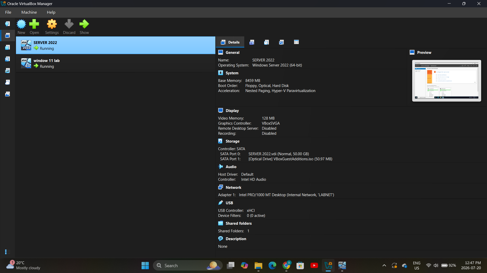

### 2. Server Manager Dashboard

Windows Server with Active Directory Domain Services and DNS installed.

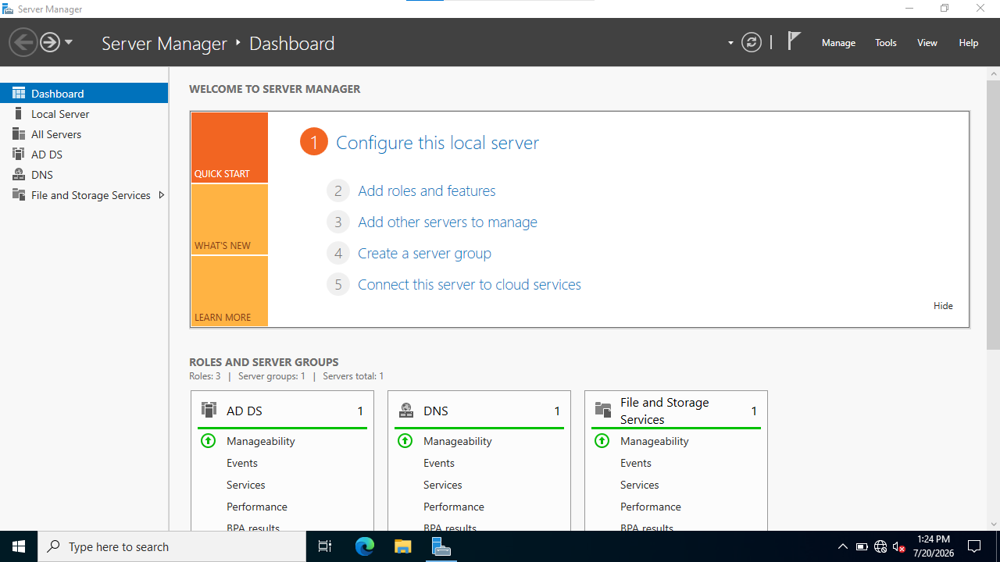

### 3. Active Directory Users

Domain user accounts managed through Active Directory Users and Computers.

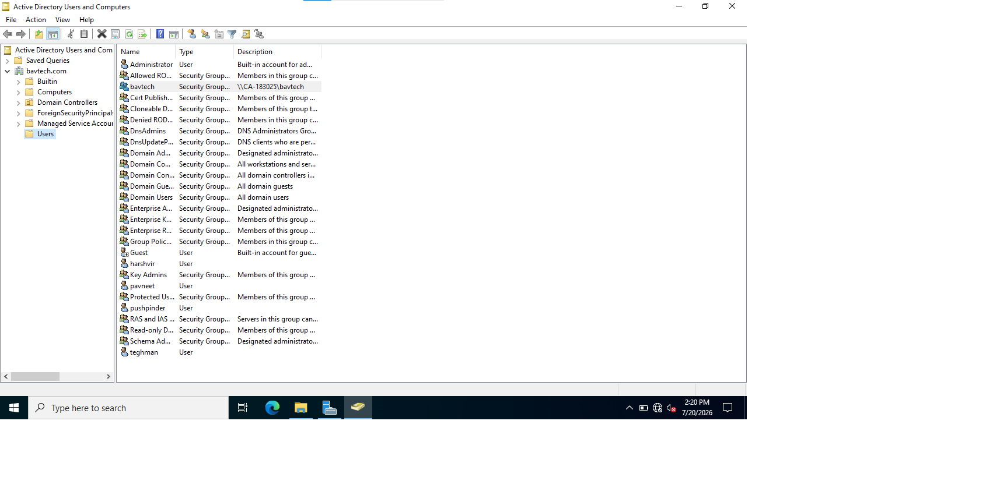

### 4. Domain Login Verification

Verification of the domain, logged-in user, and authenticating domain controller.

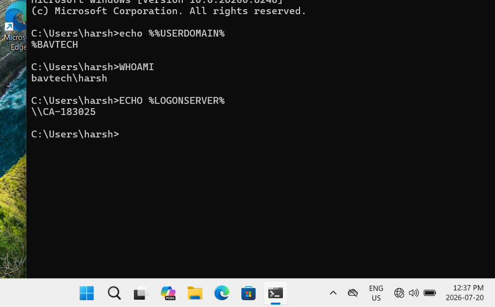

### 5. Group Policy Management

Group Policy configured and linked to the `bavtech.com` domain.

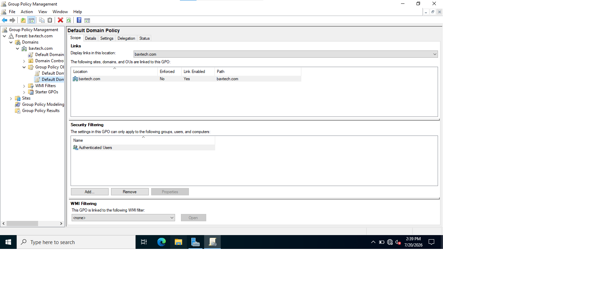

### 6. DNS Forward Lookup Zone

DNS records for the domain controller and Windows 11 client.

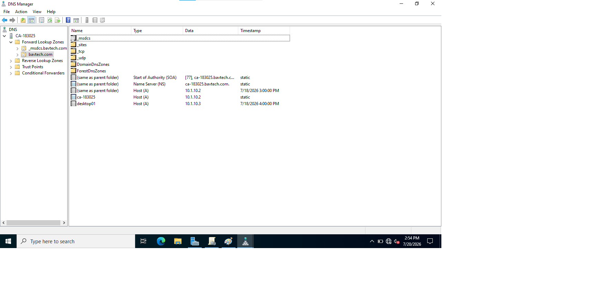

### 7. Network and DNS Connectivity

Windows 11 IP configuration, DNS resolution, and successful communication with the domain controller.

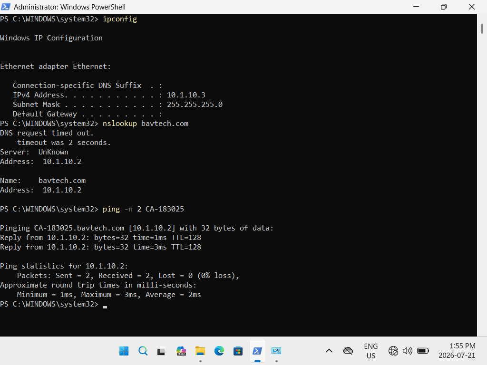

### 8. Forward and Reverse DNS Verification

Successful forward and reverse DNS queries after creating the PTR record.

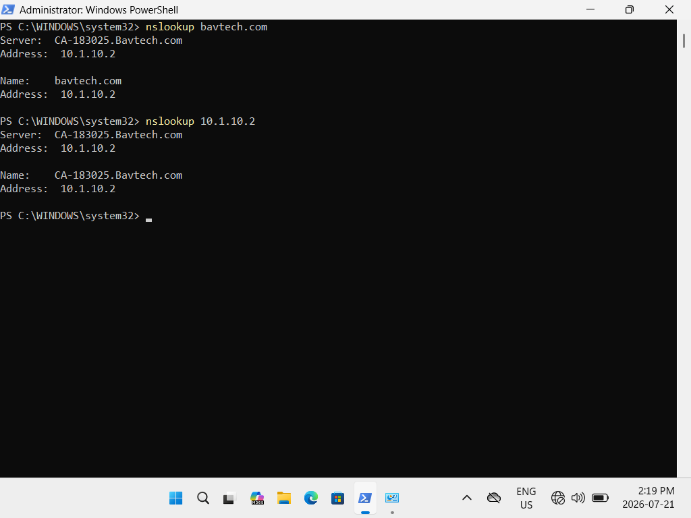

### 9. Security Group Membership

Multiple domain users added to the `bavtech` security group.

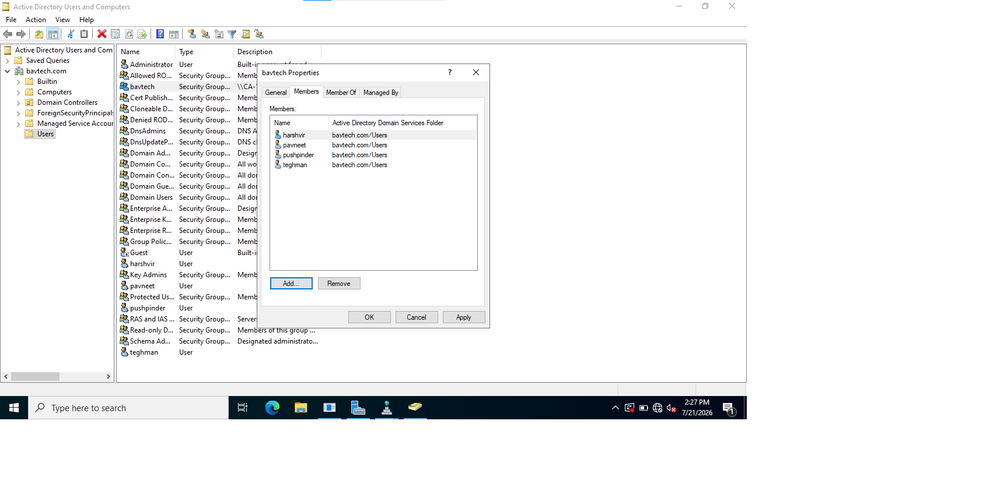

### 10. Shared-Folder Permissions

NTFS permissions assigned to the `BAVTECH\bavtech` security group.

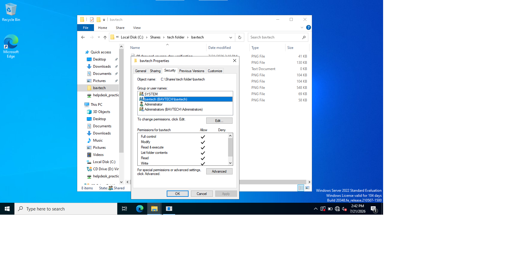

### 11. Client Shared-Folder Access

A domain user accessed the server share and created a test file, confirming read and write access.

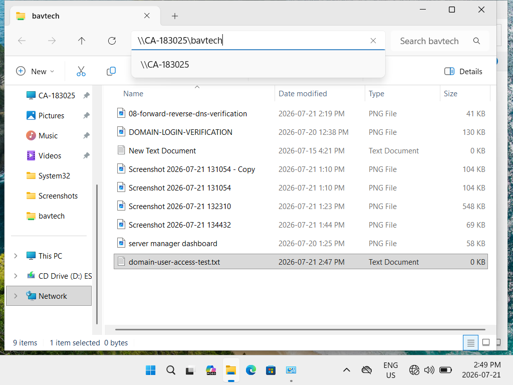

## Troubleshooting Performed

The Windows 11 client initially used external IPv6 DNS servers instead of the domain controller. I identified the issue using `ipconfig /all` and `nslookup`, configured the client to use `10.1.10.2`, disabled the unwanted IPv6 DNS configuration, cleared the DNS cache, and verified successful name resolution.

I also created a reverse lookup zone and PTR record so that `10.1.10.2` correctly resolved to `CA-183025.bavtech.com`.

## Skills Demonstrated

- Active Directory administration
- Domain-user and security-group management
- Windows domain joining and authentication
- Group Policy configuration
- DNS configuration and troubleshooting
- Forward and reverse DNS resolution
- TCP/IP configuration and connectivity testing
- NTFS and shared-folder permission management
- Technical troubleshooting and documentation
